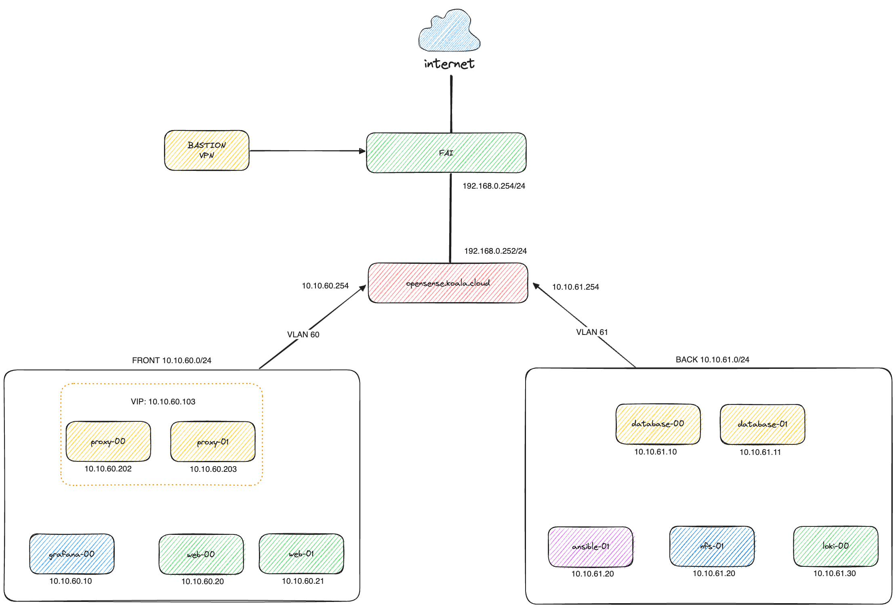

# Titre

# Plan d'adressage

Dans un premier temps, nous avons réalisé un plan d’adressage de manière à créer deux sous-réseau pour le VLAN front et back.

| Nom            | VLAN Front    | VLAN Back     |
| -------------- | ------------  | --------------|
| IP sous réseau | 10.10.60.0    | 10.10.61.0    |
| Masque         | 255.255.255.0 | 255.255.255.0 |
| Passerelle     | 10.10.60.254  | 10.10.61.254  |
| Broadcast      | 10.10.60.255  | 10.10.61.255  |

## Architecture Réseau

Maintenant que nous avons le plan d’adressage, il nous est désormais possible de réaliser la modélisation de l’architecture.

Comme illustré dans le schéma ci-dessus, notre réseau est divisé en deux sous-réseaux distincts : le front et le back.

Dans le front, on retrouve :

* 2 proxy / load-balancers, ils ont pour roles de répartir la charge entre les différents serveurs, assurant ainsi une distribution équilibrée des requêtes. Cette fonction est mise en œuvre grâce à l'utilisation de HAProxy et de keepalived.
* 2 serveurs web, avec du apache
* 1 serveur grafana pour surveiller et à la visualiser les performances du réseau et des applications

Puis dans le back, on retrouve :

* 1 serveur ansible sur lequel on retrouve nos playbooks
* 2 serveurs de bases de données, mariadb
* 1 serveur loki pour l''agrégation et à l'analyse des journaux
* 1 serveur NFS sur lequel on retrouve la configuration de kanboard

## Démonstration

### Execution playbook ansible

[Execution playbook ansible](https://www.youtube.com/watch?v=kEErIgz4k6g)

### MariaDB Galera 

[Creation BDD + Replication](https://youtu.be/mSk_c7yrza4)

### Kanboard & HA Proxy

[HAProxy & Kanboard](https://www.youtube.com/watch?v=QUFcWhP8TWw)

### Playbook opnsense

[Execution playbook](https://youtu.be/SZFz1TTxgcA)

### Serveur NFS

## Tableau de bord Grafana 

### Expression loki(LogQL) utiliser

*
*
*
*
